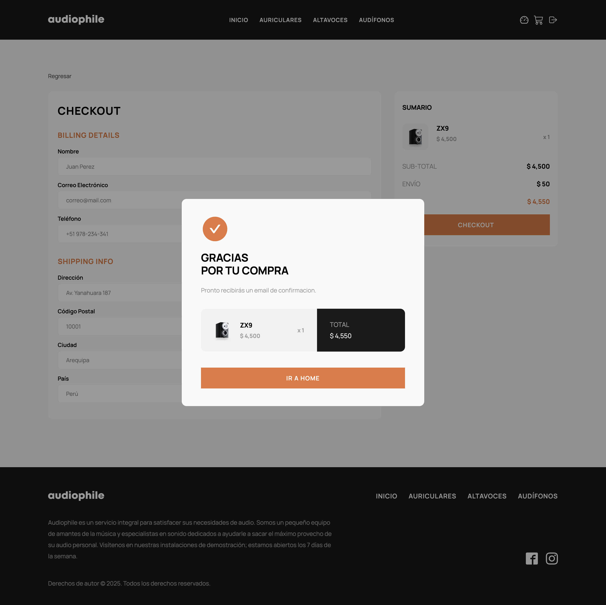

# 🎧 Ecommerce Audiophile — Tienda de Audio Profesional

**Ecommerce Audiophile** es una tienda en línea moderna y responsiva especializada en equipos de audio de alta gama.  
Ofrece navegación intuitiva, carrito de compras, checkout con validación y diseño adaptado a todo tipo de dispositivos.

🌐 **Sitio en producción**:  
👉 [Ver sitio desplegado en Vercel](https://ecommerce-audiophile-five.vercel.app/)

---

## 🧠 Funcionalidades principales

- ✅ Página de inicio con productos destacados
- ✅ Página de listado de productos por categoría
- ✅ Página individual de producto con galería e información detallada
- ✅ Carrito de compras con resumen dinámico
- ✅ Proceso de checkout con validación de campos
- ✅ Responsive design (mobile, tablet y desktop)

---

## 🛠️ Tecnologías utilizadas

- ⚛️ **Next.js 13+** (App Router)
- 💅 **TailwindCSS**
- 🔐 **TypeScript**
- 📦 **Render** (para backend y base de datos)
- 🖼️ Optimización de imágenes con `next/image`

---

## 🖼️ Capturas del sitio

| Página de inicio                 | Página de productos por categoría      | Checkout                               |
| -------------------------------- | -------------------------------------- | -------------------------------------- |
|  |  |  |

---

## 📁 Estructura del proyecto

```bash
front/
├── assets/               # Imágenes para documentación y diseño
├── public/               # Recursos públicos
├── src/                  # Código fuente
│   ├── app/              # App Router (Next.js)
│   ├── components/       # Componentes reutilizables
│   ├── context/          # Context API (carrito, usuario, etc.)
│   ├── helpers/          # Funciones utilitarias
│   ├── interfaces/       # Tipado global con TypeScript
│   ├── services/         # Llamadas a API / lógica de negocio
│   └── validators/       # Validación de formularios
└── README.md
```
